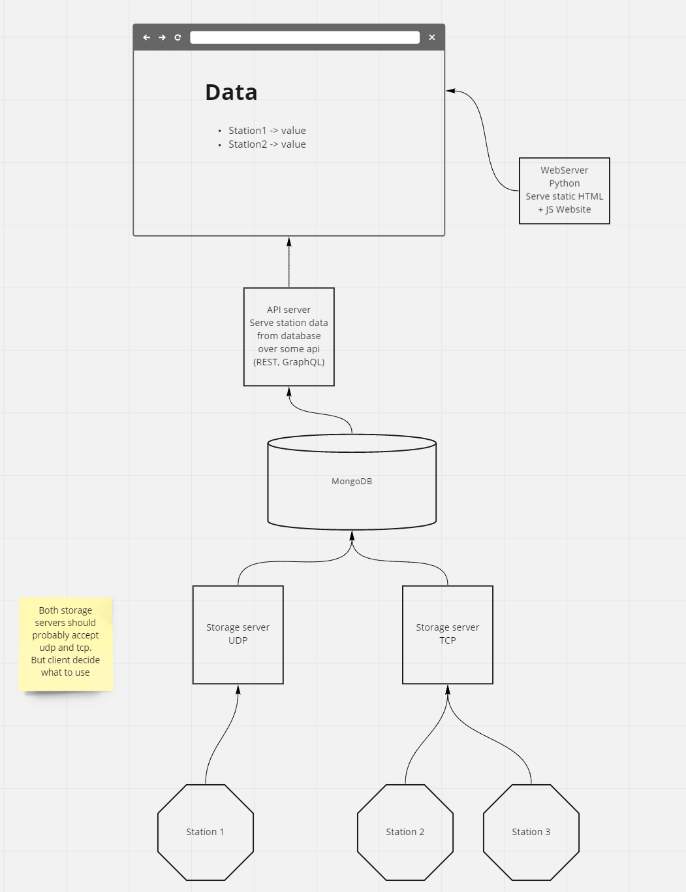

# INF142-Project

Mandatory assignment 2

## Proposal

- Station client, randomly using UDP / TCP
- Storage server accepting UDP and TCP connections
- MongoDB for storing sensor data
- WebServer for serving frontend and serving REST API for reading sensor data from MongoDB
- Frontend with some simple Javascript code for fetching data from REST API

## Run all containers:

1. `docker-compose up`
2. Visit `localhost:5000` in browser
3. Success

#### Build new docker images after code modifications:

1. Close current running docker-compose by either interrupting the terminal or `docker-compose down`
2. Delete old docker images: `docker image rm web-server storage-server station -f`
3. Rebuild and start: `docker-compose up`
4. Answer `y` when asked to replace old containers

## Getting started with web-server (local)

1.  Run the following command in the root folder:

    `pip install -r requirements.txt`.

2.  Set up a .env file with the following variables in the web-server folder:

    - APP_PORT
    - MONGODB_DATABASE
    - MONGODB_USERNAME
    - MONGODB_PASSWORD
    - MONGODB_HOSTNAME

3.  Run the following command `python server.py` in the web-server folder to
    start the server.
